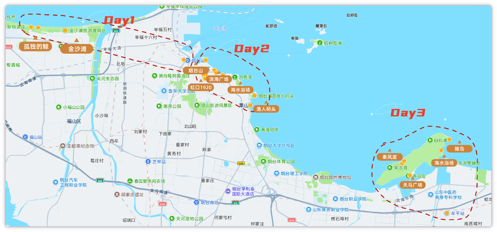
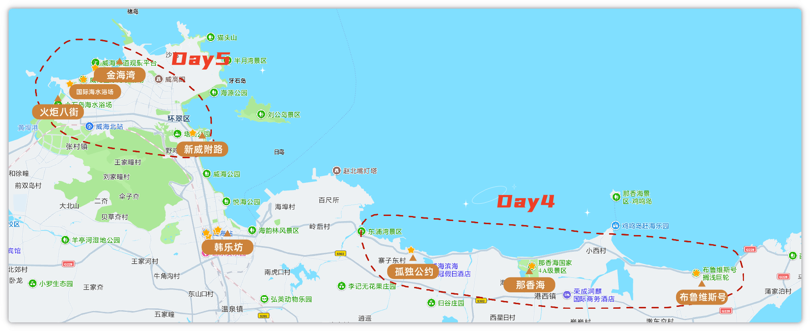

# 烟台威海五日游：一次靠海的松弛之行

> 配图放 [assets/](./assets/)。正文已定稿。

---

## 一、开场

这次印象最深的不是金沙滩，是荣成海边的布鲁维斯号，拍照确实好看，人也晒得够呛。

2026 年 6 月 1 到 5 号，两个大人带四岁孩子，走了五天：烟台看海，转到威海后租车，荣成环海和威海市区都开。节奏适中，不算躺平也不是特种兵；热是真热，好在一路都靠海。

整体感觉烟台一般，威海更舒服。如果只记一个点，就是布鲁维斯号。

---

## 二、这篇适合谁

适合想看海、带着小孩慢慢玩的人。五天里要走一段路，还要倒一次高铁，威海这边还得租车开几天（不是只开荣成那一天），接受不了这些的话会比较累。

不太适合两种人：一种是只想酒店躺平、不想折腾交通；一种是想特种兵刷景、只追网红点——这次路线偏松，景点也不会排满。

我们真实节奏算适中：有海风发呆的时候，也有一整天沿海走下来腿酸的时候（主要是烟台那天）。

---

## 三、总览：我们实际怎么走的

| 天   | 计划                         | 实际                         | 一句话评价                       |
| --- | -------------------------- | -------------------------- | --------------------------- |
| D1  | 抵达烟台 → 金沙滩日落               | 抵达烟台 → 金沙滩日落               | 到站不赶，金沙滩日落从容，孤独的鲸值得停        |
| D2  | 芝罘海岸线（烟台山–虹口1920–渔人码头–所城里） | 芝罘海岸线（烟台山–虹口1920–渔人码头–所城里） | 走得最多最累，海边还行，所城里偏商业          |
| D3  | 滨海中路 / 养马岛 → 转威海           | 养马岛 → 转威海                  | 转场顺利，养马岛一般（租电动别乱跟司机），韩乐坊吃得爽 |
| D4  | 荣成环海自驾（鸡鸣岛–那香海–布鲁维斯–孤独公约）  | 布鲁维斯–那香海–孤独公约              | 起晚错过鸡鸣岛，剩下打卡点都出片            |
| D5  | 火炬八街清晨 → 金海湾 / 猫头山 → 返程    | 新威附路–火炬八街–威海国际海水浴场–金海湾     | 五天最值：火炬八街出片，金海湾日落好看         |

总结：

> 五天实际路线：烟台两天半看海，牟平转威海；到威海后租车贯穿后面行程（荣成打卡 + 市区收尾），不是只租一天。
> 最值的是 D5——火炬八街和金海湾，懒得早起也会觉得值。
> 最累的是 D2，芝罘海岸线一路走下来腿酸。
> 若重来，会重排 D3 养马岛：滨海中路没去成，岛上也踩了租电动的坑，转场本身倒是稳的。

---

## 四、地图总览

---

## 五、分日回顾

### D1 抵达与金沙滩

下午到烟台（15:51），入住如家商旅（火车站客运码头店），放下行李就去金沙滩看日落，顺路停了「孤独的鲸」。

最推荐孤独的鲸——专程绕一下值得，打卡的人不少，出片稳。几乎没坑：到站完全来得及赶日落，时间很富裕，不用一下车就狂奔。

晚饭吃的家常菜，便宜好吃（店名可再补）。酒店离烟台站很近，步行就到，带娃转机方便；住着还好，图的是位置。

### D2 芝罘海岸线

路线大概是：烟台山看灯塔俯瞰海和城 → 滨海广场歇脚 → 虹口1920逛文创拍照 → 渔人码头看海 → 第二海水浴场觉得一般，改去第一海水浴场 → 傍晚所城里。

这天走得最多。最推荐渔人码头，腿酸的时候在这儿歇着看海最值。17 路双层巴士二楼左手边想拍海，人多没抢到，要去就早点占座。所城里商业气息重，别指望烟火气；第二海水浴场可砍，第一海水浴场体感更好。

上午老烟台灌汤包，海鲜很新鲜；下午蓝白，正常快餐垫肚子。仍住如家。鞋要舒服，带娃更要控节奏，别把点排太满。

### D3 养马岛转场

早上没赶滨海中路，吃完早饭买了零食，带行李直奔养马岛；岛上走了海水浴场、獐岛、秦风崖，玩完从牟平站高铁转威海。晚上住绿茵岛咖啡酒店，去韩乐坊吃第一顿。

最推荐韩乐坊：卷凉皮、炸串、鲷鱼烧、锅包肉、广信牛奶都能点，量大好吃，带娃也合适。养马岛本身别抱太高预期——三点看下来差强人意，景色一般。

转场本身稳。坑在租电动：网约车司机会带去他自己合作的点，不如直接去天马广场租。滨海中路这次没去成，重来的话要重新排上午。酒店在威海高铁站旁，步行可达，服务态度很好，愿意复住。

### D4 荣成自驾

威海站一嗨取车（点位在站内，不太好找；车是威海段全程用，不是只开荣成这一天），然后往荣成打卡布鲁维斯号、那香海、孤独公约咖啡馆；晚上开回市区，又去了韩乐坊。鸡鸣岛因为起晚没去成。

最推荐布鲁维斯号，拍照确实好看，也是整趟印象最深的点；孤独公约同理，出片，值得停。环海路开车顺，但我们一路赶打卡，风景没怎么认真看，别抱太高「一路都是大片」的预期。起晚的代价就是鸡鸣岛整段直接没了。晚饭继续韩乐坊。

### D5 威海收尾与返程

车还在手上。最先去新威附路 → 火炬八街（没赶 7:30，人已经很多，但出片很好）→ 国际海水浴场看海发呆睡觉 → 金海湾看日落。猫头山没去，直接砍了。看完日落后还车，再返程。

最推荐火炬八街 + 金海湾日落，五天里最值的一天，懒得早起也会觉得值。新威附路排在第一站就不推荐——基本都是店铺，没什么逛头，别专门绕。火炬八街晚去也行，接受人多就好；想空一点还是得起早。

酒店就在高铁站附近，取行李、还车、进站都相对省心。金海湾看完日落后再还车返程，时间充裕，不用卡点狂奔——住站旁 + 全程租车，收尾不慌。

---

## 六、安利与避雷

### 必去 Top 3

1. **韩乐坊**——吃的多也好吃，威海晚上首选；我们去了两晚。
2. **威海国际海水浴场**——沙子干净，人相对没那么多，适合带娃发呆睡觉。
3. **荣成线（布鲁维斯 / 那香海 / 孤独公约）**——出片，印象最深的画面基本都在这儿。

### 可去可不去

- **烟台山**：灯塔俯瞰海和城还行，山里其他地方没什么可玩的，有时间再上。
- **养马岛**：海水浴场、獐岛、秦风崖走下来差强人意；转场顺路可以去，别当行程高潮。
- **火炬八街**：值得去、出片好；没起早也行，接受人多就好。想空一点再赶早。

### 强烈不建议 / 可砍

- **烟台滨海广场**：无聊，没什么景色，还费腿。
- **新威附路**：基本都是店铺，别专门绕。
- **第二海水浴场**：一般，不如第一海水浴场。

### 对照计划：哪些注意事项事后证明超级准

- 荣成线距离远，**必须租车**；我们是威海段全程租，不是只开一天。
- 一嗨取车点在高铁站内，**不太好找**，预留找店时间。
- 芝罘海岸线**步行强度大**，鞋要舒服，带娃控节奏。
- 养马岛租电动：**别跟着网约车司机去他的点**，天马广场更稳。

### 哪些其实过虑了

- 荣成去程阴天，到布鲁维斯号放晴了——天气别太早放弃。
- D1 怕 15:51 到站赶不上金沙滩日落：其实时间很富裕。
- D5 怕看完日落赶不上火车：住站旁 + 看完再还车，时间充裕。
- 火炬八街「不去超早就废了」：人是多，但晚去照样能出片，没必要吓自己。

总结：

> 若只问必去：韩乐坊填肚子，国际海水浴场躺平，荣成线拍照。
> 烟台山、养马岛有时间再去；滨海广场、新威附路、第二海水浴场可以砍。
> 计划里最该听的是：荣成要租车、站内取车不好找、烟台那天真的很走路。
> 最不用慌的是：阴天、赶日落、赶火车——这三样我们都虚惊一场。

## 七、吃住行实测

### 住

| 酒店               | 位置         | 睡眠  | 复住  | 一句话               |
| ---------------- | ---------- | --- | --- | ----------------- |
| 如家商旅（烟台火车站客运码头店） | 离烟台站很近，可步行 | 好   | 一般  | 图位置，住着还好，带娃转机方便   |
| 绿茵岛咖啡酒店（威海高铁站店）  | 离威海站很近，可步行 | 好   | 愿意  | 服务态度很好，还车进站都省心，推荐 |

总结：

> 烟台住如家就为了挨着站，步行可达，睡眠还行，复住意愿一般。
> 威海绿茵岛咖啡酒店更推荐：站旁、服务好，租车还车 + 返程取行李都顺。

### 吃

**烟台**

- D1 家常菜：便宜好吃，还不错（店名可再补）
- D2 上午 老烟台灌汤包：海鲜很新鲜，值得吃
- D2 下午 蓝白：正常快餐，垫肚子够用

**威海**

- D4 早餐小笼包：有就行，没特别印象
- **韩乐坊**（去了不止一晚，晚上首选）
  - 乳山炸甩：强烈推荐
  - 广信牛奶、铜锣烧：推荐
  - 锅包肉、鲷鱼烧：不错
  - 另外还吃过卷凉皮、炸串等，量大好吃，带娃也合适
- 孤独公约：小蛋糕 + 咖啡，味道中等，主要图出片

总结：

> 烟台吃：灌汤包新鲜，蓝白随便填肚子，D1 家常菜实惠。
> 威海吃基本围着韩乐坊转——炸甩最值得点，牛奶和铜锣烧也能安排；孤独公约咖啡蛋糕一般，别冲着味道去。

### 行

- **烟台市内：** 打车方便；17 路双层巴士想拍海要早点抢二楼左手边，我们没抢到。
- **养马岛：** 租电动去天马广场更稳，别跟网约车司机去他的合作点。
- **高铁转场（烟台 → 牟平 → 威海）：** 按票走就稳，没什么幺蛾子。
- **威海段全程租车（含荣成）：** 一嗨取车在高铁站内不太好找；用到 D5 返程前还车；环海路好开，市区停车不太方便。
- **哪段最省心：** 住威海站旁 + 车开到返程——取还车、进站一条线，比烟台那天沿海走轻松。

总结：

> 烟台靠打车和走路；养马岛坑在租电动选点。
> 牟平转威海按票走就行。威海段直接租全程，荣成和市区都开；取车点难找、市区停车烦，但站旁还车返程很省心。

### 花费体感

| 项目                 | 金额         |
| ------------------ | ---------- |
| 交通（含高铁 / 打车 / 租车等） | 2000       |
| 住宿                 | 880        |
| 餐饮                 | 610        |
| 购物                 | 250        |
| **合计**（2大1小·5天）    | **约 3740** |

- 大头：**交通**（高铁转场 + 威海段全程租车占大头）
- 体感：吃住都不算贵；真贵的是来回挪和租车。两人一带娃五天，这个量级偏「能玩开、没乱花」。

总结：

> 五天账本大概：交通 2000、住宿 880、餐饮 610、购物 250，合计三千七左右。
> 大头在交通——倒高铁加威海全程租车；住宿和吃饭反而克制。想省就砍购物、少打车，租车这块不好省，荣成线基本靠它。

---

## 八、收尾：写给下一个去的人

如果只剩 3 天，我会直接冲威海：韩乐坊、国际海水浴场、荣成线出片、火炬八街和金海湾日落。烟台那段可以砍或大幅压缩。

如果重来，我会把时间匀给鸡鸣岛（这次起晚没去成），再加逛几个威海市区的公园，少在养马岛和烟台费腿的点上耗。

真心话：热是真热，海是真好看；整体烟台一般，威海更舒服。带娃慢慢走一趟够了，别排特种兵。

路线、吃住有疑问直接问，能想起来的我都回。

